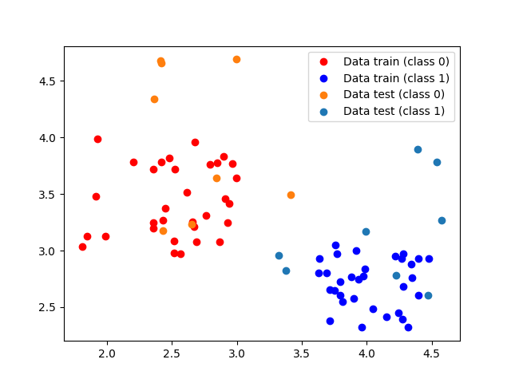

# K-Means clustering algorithm in C++

This is a simple implementation of K-means algorithm in C++. 

## What is K-Means clustering algorithm and how does it work?

K-means clustering is an algorithm that partitions *n* observations  into *k* clusters in which each observation belongs to the cluster with the closest mean.

*k* is a user defined parameter that has to be provided beforehand. 

1) The algorithm first assigns each point to a random cluster. 

2) The center of each cluster is calculated, for *i*-th cluster  is the formula as follows:

    

3) We assign each point to the closest centroid (based on the Euclidian distance).

4) The algorithm performs steps 2) and 3) in each iteration *t*. 
5) The algorithm converges, when the assignments no longer change. 
 
However, the K-Means algorithm is not guaranteed to find the optimum. 

## Compilation

Just run:
`g++ src/main.cpp -o kmeans.out`

Execute with:
`./kmeans.out`

The algorithm takes data from `data_train.csv` and `data_test.csv`. This version supports three-dimensional data points.

Tested on Linux.
